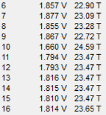
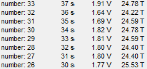
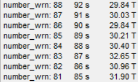

# Test_Task
Используя отладочную плату BluePill (либо аналог на stm32f103cx) и среду STM32CubeIDE. C11 (можно with GNU extensions). Использовать библиотеку HAL. Код выводить в отдельные модули.

* Написать модуль форматированного логирования с настраиваемыми уровнями (inf, dbg, wrn, err) с возможностью переопределения способа вывода информации (UART, USB, какой-то заранее неизвестный интерфейс), например log.debug(“ADC value is %2.2f\n\r”, adc_value);
* Настроить USB как виртуальный COM-порт и направить вывод  информации туда, обратить внимание на реализацию вывода данных через предлагаемый CubeMX CDC-класс;
* Настроить работу какого-нибудь таймера для отсчёта секундного интервала;
* Настроить 10 каналов АЦП по DMA, усреднить значения по 8-ми измерениям и перевести значения в напряжения, для канала с внутренним датчиком температуры в градусы Цельсия.
  
В main.c до входа в главный цикл устройство должно ожидать подключение по USB. После подключения устройство ждёт 5 секунд и переходит в главный цикл. В главном цикле раз в секунду выводится номер измерения и текущее состояние по ходам (напряжения и температура МК) в виде таблицы. Если в ходе работы пользователь отключает устройство от USB, а 
питание устройства сохраняется, необходимо перезапустить устройство, предварительно запомнив номер измерения. Например, на 20-ом измерении устройство отключают от USB и подключают снова. После детектирования включения устройство ждёт 5 секунд и продолжает вывод начиная с 20-го измерения.
___

Файл main.c начинается с инициализации переменных
```c
#define ARR_LOG 8          // размер массив для логирования
#define ADC_CHANNELS_NUM 9 // количестов каналов АЦП
#define tV_25   1.34f      // напряжение (в вольтах) на датчике при температуре 25 °C.
#define tSlope  0.0043f    // изменение напряжения (в вольтах) при изменении температуры на градус.

uint16_t adcData[ADC_CHANNELS_NUM];              // массив данных с ADC
char transmit_str[80] = {0,};                    // массив для записи и передачи времени, напряжения и температуры
uint8_t flag_adc = 0;                            // флаг ADC
uint8_t flag_tim = 0;                            // флаг TIMER

unsigned int second = 0;                         // переменная, сохраняющая секунды
float average_voltage = 0;                       // значение напряжения, усредненное по 8-и каналам
float temp = 0;                                  // значение температуры
unsigned int measurement_number = 0;             // номер измерения

uint8_t flag_receive = 0;                        // флаг RECIVER
char command_code;                               // код команды

unsigned int arr_second_log[ARR_LOG] ={0,};      // массив секунд
float arr_voltage_log[ARR_LOG] = {0,};           // массив напряжений
float arr_temp_log[ARR_LOG] = {0,};              // массив температур

unsigned int arr_second_log_wrn[ARR_LOG] ={0,};  // массив времени предупреждения
unsigned int arr_number_log_wrn[ARR_LOG] = {0,}; // массив номеров измерений с предупреждением
float arr_temp_log_wrn[ARR_LOG] = {0,};          // массив превышенной температуры
```
Пропишим прототипы функций.
```c
/* USER CODE BEGIN PFP */

void array_shift_int(unsigned int arr[]);
void array_shift_float(float arr[]);
void logging(const unsigned int number_log, const unsigned int second_log, const float voltage_log, const float temp_log);
void logging_wrn(const unsigned int number_log, const unsigned int second_log, const float temp_log);
void print_log_inf_usb(unsigned int number_log);
void print_log_wrn_usb();

/* USER CODE END PFP */
```
* Функуия `array_shift_int` отвечает за циклический сдвиг впарво значений массива типа unsigned int;
* Функуия `array_shift_float` отвечает за циклический сдвиг впарво значений массива типа float;
* Функуия `logging` сохраняет значения времени, напряжения и температуры для дальнейшего логирования;
* Функуия `logging_wrn` сохраняет значения номера измерения, времени и температуры для дальнейшего логирования (предпологаетс, что при температуре выше 28 градусов, данные запоминаются в области WRN);
* Функуия `print_log_inf_usb` печатает данные из области INF через usb port;
* Функуия `print_log_wrn_usb` печатает данные из области WRN через usb port.

Пропишем колбэк-функции.
```c
/* USER CODE BEGIN 0 */
void HAL_ADC_ConvCpltCallback(ADC_HandleTypeDef* hadc)
{
  if(hadc->Instance == ADC1)
  {
	  flag_adc = 1;
  }
}
void HAL_TIM_PeriodElapsedCallback(TIM_HandleTypeDef *htim1)
{
	if(htim1->Instance == TIM1)
	{
		flag_tim = 1;
		++second;
	}
}
/* USER CODE END 0 */
```
* После окончания преобразования каналов АЦП поднимается флаг flag_adc;
*  При переполнении счетсика таймера TIM1 поднимается влаг flag_tim и значение переменной second инкрементируется на еденицу.
___

Главный цикл программы:
```c
  while (1)
  {
	  if(flag_tim == 1)
	  {
      	++measurement_number;
      	sprintf(transmit_str, "%u \t %.3f V\t %.2f T\t\r\n", measurement_number, average_voltage, temp);
      	logging(measurement_number, second, average_voltage, temp);
      	if(measurement_number < 10){
      		CDC_Transmit_FS((uint8_t*)transmit_str, 23);
      	} else if (measurement_number >= 10 && measurement_number < 100){
      		CDC_Transmit_FS((uint8_t*)transmit_str, 24);
      	} else if(measurement_number >= 100 && measurement_number < 1000){
      		CDC_Transmit_FS((uint8_t*)transmit_str, 25);
      	} else {
      		CDC_Transmit_FS((uint8_t*)transmit_str, 26);
      	}
      	HAL_ADC_Start_DMA(&hadc1, (uint32_t*)adcData, ADC_CHANNELS_NUM);
      	HAL_GPIO_TogglePin(GPIOC, GPIO_PIN_13);
      	flag_tim = 0;
	  }

	  if(flag_adc == 1)
	  {
		  average_voltage = 0;
		  temp = 0;
		  for (uint8_t i = 0; i < ADC_CHANNELS_NUM; i++)
		  {
			  if(i == 8){
				  temp = ((adcData[i] * 3.3) / 4095);
				  temp = ((tV_25 - temp) / tSlope) + 25;
				  if(temp > 28){
					  logging_wrn(measurement_number, second, temp);
				  }
			  } else {
				  average_voltage += ((adcData[i] * 3.3) / 4095);
			  }
		  }
		  average_voltage /= 8;
		  flag_adc = 0;
	  }

	  if(flag_receive == 1)
	  {
		  switch(command_code)
		  {
		  case '1':
			  print_log_inf_usb(measurement_number);
			  break;
		  case '2':
			  print_log_wrn_usb();
			  break;
		  }
	      flag_receive = 0;
	  }
    /* USER CODE END WHILE */

    /* USER CODE BEGIN 3 */
  }
  /* USER CODE END 3 */
}
```

1. При переполнении счечика таймера:
   * инкрементируем номер измерения
   * сохраняем значение времени, напряжения и температуры
   * формируем строку, передающую номер измерения напряжение и температуру
   * передаем данные через virtual com port
   * запускаем преобразование АЦП
2. При окончании преобразования АЦП:
   * переводим отсчеты в значение напряжение
   * усредняем напряжение по 8 каналам
   * переводим отсчеты в значение температуры, при температуре выше 28 градусов, данные запоминаются в области WRN
3. При приеме данных через virtual com port
   * определяем код принятой команды
   * вызываем соответствующую функцию печати 

______
Тело функций `array_shift_int`, `array_shift_float`, `logging` и `logging_wrn`:
```c
/* USER CODE BEGIN 4 */

void array_shift_int(unsigned int arr[]){
    for(int i = ARR_LOG - 1; i > 0; --i){
        arr[i] = arr[i - 1];
    }
}
void array_shift_float(float arr[]){
    for(int i = ARR_LOG - 1; i > 0; --i){
        arr[i] = arr[i - 1];
    }
}

void logging_wrn(const unsigned int number_log, const unsigned int second_log, const float temp_log)
{
	array_shift_int(arr_number_log_wrn);
	array_shift_int(arr_second_log_wrn);
	array_shift_float(arr_temp_log_wrn);

	arr_number_log_wrn[0] = number_log;
	arr_second_log_wrn[0] = second_log;
	arr_temp_log_wrn[0] = temp_log;
}
void logging(const unsigned int number_log, const unsigned int second_log, const float voltage_log, const float temp_log)
{

	array_shift_int(arr_second_log);
	array_shift_float(arr_voltage_log);
	array_shift_float(arr_temp_log);

	arr_second_log[0] = second_log;
	arr_voltage_log[0] = voltage_log;
	arr_temp_log[0] = temp_log;
}
```
___
Печать логов реализованна только для INF и WRN через virtual com port, так как слишком долго прописывать реализацию для каждого уровня (inf, wrn, dbg, err), для каждого интерфеса, но последующая реализация печати логов может быть основана на уже готовых функциях.

К сожалению сканировать подключение платы через COM port не удалось. В качестве решения можно было бы подключить один из выводов АЦП к шине питания COM port, тем самым сканировать подключение по USB.
___
## Результаты моделирования

Передача данных раз в секунду:



Выполнение функции `print_log_inf_usb`:



Выполнение функции `print_log_inf_usb`:




